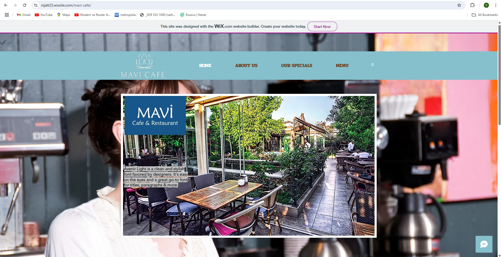
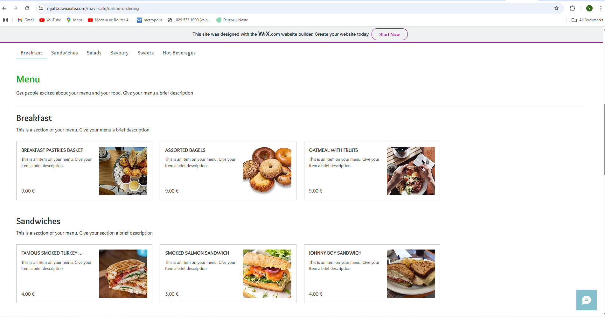
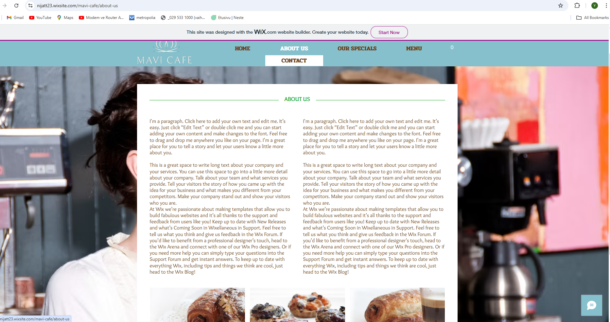
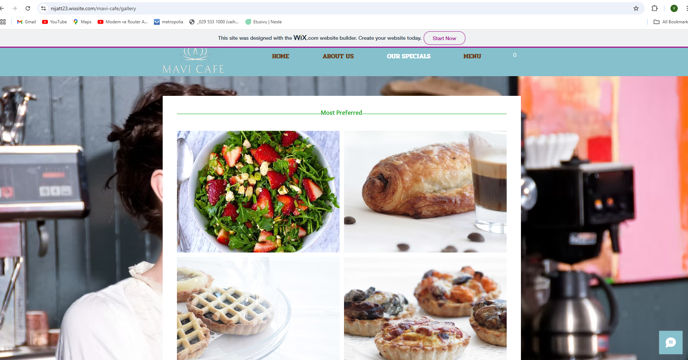

# Mavi Cafe – Website Project with Wix

This repository documents the creation of a sample website for a fictional small business called **Mavi Cafe**, created using the **Wix Content Management System** as part of a CMS evaluation task.

## 📌 Project Overview

**Mavi Cafe** is a concept cafe , The aim of this project was to build a representative website for the business using a no-code CMS and evaluate the usability, performance, and general experience of the platform.

The website was created entirely using Wix’s drag-and-drop editor with a pre-built template, and no custom code was written.

## 🔧 CMS Platform: Wix

### What is Wix?

Wix is a **hosted website builder and content management system (CMS)** that allows users to create websites through a visual interface. It is well-suited for individuals and small businesses that want to get online quickly without needing technical expertise.

### Technical Requirements

- No installation required
- Works in any modern web browser
- No hosting or server configuration needed
- Integrated deployment (published via Wix domain or custom domain)

### Is Wix Headless?

No. **Wix is a traditional CMS**, not a headless CMS. In headless CMS platforms, the content management backend is separated from the frontend (e.g., data is delivered via API to a custom frontend). Wix, on the other hand, manages both backend and frontend in a tightly integrated visual interface.

## 🚀 Website Features

Here are the key sections and content of the **Mavi Cafe** website:

- **Home**: Welcome message and branding
- **About Us**: Business story and background information
- **Our Specials**: Highlighted menu items
- **Menu**: Full menu with categories including Breakfast, Sandwiches, Salads, Sweets, and Hot Beverages. Each item includes name, description, price, and image.
- **Contact**: Location  contact details, and a contact form
- **Online Ordering**: Simple interface to place online pickup or delivery orders

> Note: The content was created using default Wix text blocks and placeholder images. No real customer data or custom styling was applied.

## 🧪 Process

1. **Signed up for a Wix account**
2. **Selected a pre-designed cafe template**
3. **Customized the text and images using Wix’s visual editor**
4. **Added sections for Menu, Contact, and Ordering**
5. **Published the website to a Wix-provided URL**

## 📷 Screenshots

## 📷 Screenshots

  
*Homepage view of Mavi Cafe.*

  
*Online menu with categories and prices.*

  
*Contact form and business location.*

  
*Specials view of Mavi Cafe.*

--

## ⚖️ Wix vs. WordPress (Brief Comparison)

| Feature           | Wix                         | WordPress                    |
|------------------|-----------------------------|------------------------------|
| Setup Difficulty | Very Easy (no setup needed) | Medium (requires hosting)    |
| Customization    | Limited to templates         | Very flexible with plugins   |
| Coding Required  | No                          | Optional (but common)        |
| Suitable For     | Beginners, small businesses | All types, especially blogs  |
| Maintenance      | Handled by Wix              | Requires user management     |

## 💬 Personal Reflections

> **Wix was surprisingly fast and easy to use.** The drag-and-drop system is intuitive, and no technical skills were needed to publish a clean-looking site.  
> However, customization options are limited compared to WordPress. I would recommend Wix for small businesses or personal projects with basic content needs.

## 🔗 Live Website

*(If you published the site, include the link here)*  
[Visit Mavi Cafe Website](https://nijatt23.wixsite.com/mavi-cafe) *(Replace this with the real URL if available)*

---

**Created by:** [Yasin]  
**Task:** CMS Comparison Project – Non-WordPress CMS Evaluation  
**Platform:** Wix  
**Submitted to:** [Course or Instructor Name]

--
